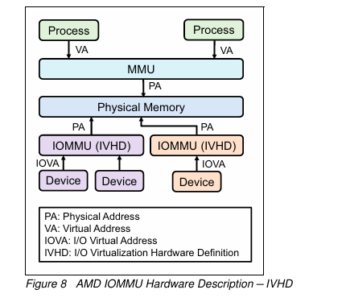

## 7. ACPI에서의 IOMMU 설명

- 시스템 플랫폼 펌웨어는 I/O 가상화를 설명하는 데이터 구조를 정의
- 이 구조를 INTEL에서는 DMA Remapping Reporting, AMD에서는 I/O Virtualization Reporting 이라고 함
- IOMMU 기능, 플랫폼의 구성을 OS 소프트웨어에 알리는데 사용되는 ACPI 테이블이 있음
- 리눅스 IOMMU 하위 시스템에서 IOMMU 하드웨어를 초기화 할 때 IOMMU 드라이버는 ACPI 테이블에서 IVRS를 파싱함 시스템 IVRS가 없으면 IOMMU 드라이버는 초기화 흐름을 무시함 반대로 IOMMU 드라이버는 하나 이상의 I/O 가상화 정의 블록을 포함하는 IVRS 기반으로 IOMMU 하드웨어를 초기화
  

#### I/O 가상화 하드웨어 정의(IVHD) : 기능과 IOMMU 하드웨어 관련된 시스템 I/O 토폴로지 뿐만아니라 IOMMU 하드웨어의 기능 및 구성을 설명

- 운영 체제가 IOMMU를 정확히 초기화하고 구성하는 데 필수적
- 효율적인 I/O 가상화 및 DMA 보호를 위한 기반 제공
- IOMMU의 물리적 위치 및 범위 정의
- 지원되는 기능 (예: 인터럽트 리매핑, 장치 격리)
- 연결된 PCI 장치 및 버스 구조 설명

#### I/O 가상화 메모리 정의( IVMD) : 특정 장치에 대한 특수한 메모리 제약 조건을 설명

- 장치별 메모리 접근 제어 구현
- 특정 메모리 영역의 보호 또는 공유 설정
- 효율적인 메모리 관리 및 최적화 지원
- 그래픽 카드를 위한 전용 메모리 영역 정의
- 특정 I/O 장치에 대한 DMA 버퍼 영역 지정   

   

### **ACPI 테이블의 IOMMU 정보와 Linux 커널의 IOMMU 초기화 과정**

1. AMD IOMMU 하드웨어 구조 (그림 설명):
    - 프로세스는 가상 주소(VA)를 사용하여 메모리에 접근
    - MMU(Memory Management Unit)가 VA를 물리 주소(PA)로 변환
    - I/O 디바이스는 IOVA(I/O Virtual Address)를 사용
    - IOMMU(IVHD)가 IOVA를 PA로 변환하여 물리 메모리에 접근

2. ACPI 테이블의 IOMMU 정보:
    - ACPI(Advanced Configuration and Power Interface) 테이블은 IOMMU 기능과 플랫폼 구성을 OS에 알림
    - AMD: IVRS (I/O Virtualization Reporting Structure)
    - Intel: DMAR (DMA Remapping Reporting)

3. Linux IOMMU 서브시스템 초기화 과정:
    - IOMMU 디바이스 드라이버가 ACPI 테이블에서 IVRS 또는 DMAR 정보를 파싱
    - 파싱한 정보를 바탕으로 I/O Virtualization Definition Blocks (IVDBs)를 생성
    - IVRS나 DMAR 정보가 없으면 IOMMU 드라이버 초기화가 중단

4. IVDBs (I/O Virtualization Definition Blocks):
   a) IVHD (I/O Virtualization Hardware Definition):
    - IOMMU 하드웨어의 기능과 구성을 설명
    - IOMMU와 연결된 시스템 I/O의 계층 구조(토폴로지)를 구성

   b) IVMD (I/O Virtualization Memory Definition):

    - 특정 장치에 대한 특별한 메모리 제약 조건을 명세

5. IOMMU 초기화 과정:
    - IOMMU 드라이버는 파싱한 IVRS(AMD) 또는 DMAR(INTEL) 정보를 기반으로 하나 이상의 I/O 가상화 정의 블록을 포함하는 IOMMU 하드웨어를 초기화

6. 목적:
    - 이 구조는 가상화 환경에서 I/O 디바이스가 메모리에 안전하게 접근
    - 시스템 자원을 효율적으로 관리하고, DMA(Direct Memory Access) 공격으로부터 시스템을 보호
   
이 과정을 통해 Linux 커널은 IOMMU 하드웨어를 정확히 인식하고 초기화하여, 가상화된 환경에서 I/O 디바이스의 메모리 접근을 안전하고 효율적으로 관리
  

### **ACPI 테이블**

- 목적:
    - 하드웨어 구성 정보를 운영 체제에 제공
    - 전원 관리 및 하드웨어 초기화에 필요한 정보를 포함
- IOMMU 관련 ACPI 테이블:
    - AMD: IVRS (I/O Virtualization Reporting Structure)
    - Intel: DMAR (DMA Remapping Reporting)
- 테이블 내용:
    - IOMMU 하드웨어의 기능과 구성 정보
    - 시스템의 I/O 계층 구조(토폴로지)
    - 특정 장치에 대한 메모리 제약 조건
- 운영 체제의 활용:
    - 부팅 과정에서 OS가 이 테이블을 읽어 IOMMU 초기화에 사용
    - Linux 커널의 IOMMU 서브시스템이 이 정보를 파싱하여 활용
- 중요성:
    - IOMMU 하드웨어의 정확한 구성과 초기화를 가능
    - 가상화 환경에서 효율적인 I/O 관리를 지원