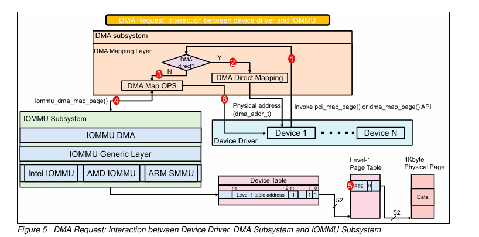

## **5. IOMMU 하드웨어별 계층은 언제 I/O 페이지 테이블을 업데이트하는가?**

DMA 요청 처리 로직

1. ACPI(Advanced Configuration and Power Interface) 테이블에 정의된 직접 매핑 일 때
    - IOMMU 하드웨어 proving/초기화 시 IOMMU 하드웨어 고유 계층은 ACPI 테이블에 저장된 직접 매핑 정보를 파싱하고 ACPI 테이블을 기반으로 I/O 페이지 테이블을 구성
2. I/O 장치로부터 DMA 요청
    - I/O 디바이스에서 DMA 요청이 시작되면 Linux 커널은 그림 5와 같이 디바이스 드라이버, DMA 서브시스템 및 IOMMU 서브시스템에서 DMA 요청을 전달하고 처리합니다.

 I/O 디바이스에서 시작된 DMA 요청이 Linux 커널의 DMA 하위 시스템과 IOMMU 하위 시스템을 통해 어떻게 처리되는지 단계별 설명임

크게 보기

- 디바이스 드라이버는 DMA 작업을 위해 가상 주소를 사용하여 DMA 하위 시스템에 요청을 보냅니다.
- DMA 하위 시스템은 요청받은 주소가 직접 매핑 가능한지 확인하고, 가능하다면 물리 주소를 바로 반환합니다.
- 직접 매핑이 불가능한 경우, IOMMU 하위 시스템에 주소 변환을 요청합니다.
- IOMMU는 주소 변환을 수행하고, 변환된 물리 주소를 DMA 하위 시스템을 통해 디바이스 드라이버에 반환합니다.  

단계별로 보기

1. **디바이스 드라이버는 pci_map_page() 또는 dma_map_page()와 같은 DMA 매핑 API를 호출합니다.**
    - 이 단계에서는 드라이버가 가상 주소를 물리적 주소로 매핑해야 함을 DMA 하위 시스템에 알립니다.
    - 가상화 환경에서는 게스트 OS의 가상 주소를 실제 하드웨어에서 사용할 수 있는 물리적 주소로 변환해야 하므로 이 단계가 특히 중요합니다.
2. **DMA 하위 시스템은 요청받은 DMA 주소가 직접 매핑(direct mapping)인지 확인합니다.**
    - 직접 매핑은 가상 주소와 물리적 주소 사이에 1:1 매핑이 있음을 의미합니다.
    - 만약 직접 매핑이 가능하다면, DMA 하위 시스템은 간단한 계산을 통해 물리적 주소를 얻어 디바이스 드라이버에 바로 반환할 수 있습니다.
    - 이 경우, IOMMU를 통한 추가적인 주소 변환이 필요하지 않습니다.
3. **DMA 요청이 직접 매핑될 수 없는 경우, DMA 하위 시스템은 iommu_dma_map_page()를 호출하여 IOMMU 하위 시스템에 도움을 요청합니다.**
    - 직접 매핑이 불가능한 경우는 주로 가상화 환경이나 주소 공간 레이아웃 랜더마이제이션(ASLR)이 활성화된 경우입니다.
    - 이러한 경우, 가상 주소를 물리적 주소로 매핑하기 위해 IOMMU의 도움이 필요합니다.
4. **DMA 하위 시스템 내부에서, iommu_dma_map_page() 함수가 호출되어 IOMMU 하위 시스템에 가상 주소를 물리적 주소로 변환해줄 것을 요청합니다.**
    - 이 함수는 가상 주소, 크기, 디바이스 정보 등을 인자로 받아 IOMMU 하위 시스템으로 전달합니다.
5. **IOMMU 하위 시스템은 하드웨어 종속적인 IOMMU 구현(예: Intel IOMMU, AMD IOMMU, ARM SMMU)을 사용하여 주소 변환을 수행합니다.**
    - IOMMU는 디바이스 테이블, I/O 페이지 테이블, 컨텍스트 테이블과 같은 데이터 구조를 관리하며, 이를 통해 가상 주소를 물리적 주소로 효과적으로 변환할 수 있습니다.
    - 주소 변환 과정에서 I/O 페이지 테이블이 업데이트되며, 필요한 경우 새로운 매핑이 생성됩니다.
    - 변환된 물리적 주소는 DMA 하위 시스템을 통해 디바이스 드라이버에 반환됩니다.  

DMA 요청은 디바이스 드라이버에서 시작하여 DMA 하위 시스템과 IOMMU 하위 시스템을 거치며 처리됩니다. 각 단계에서 필요한 주소 변환과 매핑이 수행되어 I/O 디바이스가 안전하고 효율적으로 시스템 메모리에 접근할 수 있게 됩니다.