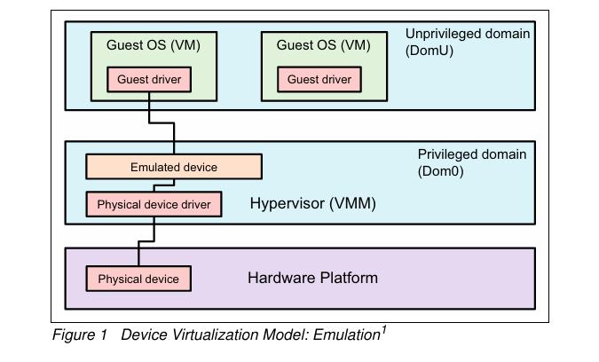
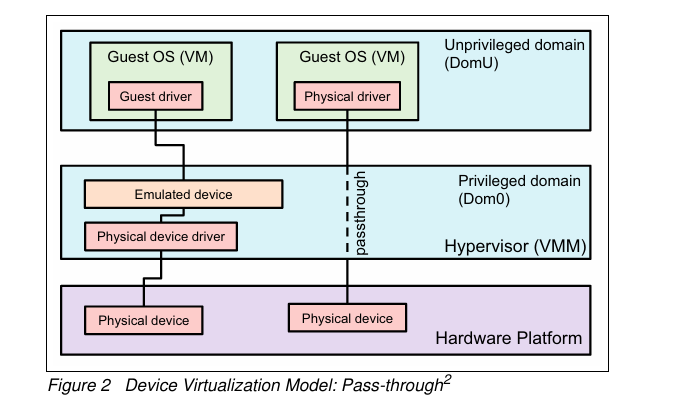

# Device Virtualization Models
하이퍼바이저 아키텍처에서 장치 애뮬레이션이 어떻게 작동하는지 설명 
하이퍼바이저 내에 장치 애뮬레이션을 통합 
장치 애뮬레이션을 하이퍼바이저 외부 애플리케이션으로 푸시

- PCI Device Virtualization에는 Emulation model
- Pass-through model   

#### 1. Emualtion Model (하이퍼바이저 기반 장치 emualtion)
   
- **하이퍼바이저가 게스트 OS(가상머신에서 실행되는 운영체) 물리적 장치사이의  모 상호 작용 조작 / 게스트 OS 요청이 오면 이를 해석하고 가상주소를 물리주소로 변환해서 물리적 장치에 맞게 변환함**
- **게스트 OS는 가상장치와 상호작용/직접 물리적 장치와 상호작용 안함**
- **하이퍼바이저가 장치 주소를 가상에서 물리적으로, 또는 그 반대로 변환**  

#### 2. Pass-through Model
   
- **게스트 OS가 하이퍼바이저 우회하여 직접적으로 물리적장치와 상호작용**
- **하이퍼바이저는 물리적 장치를 에뮬레이트하고 디바이스 주소를 변환하는 전용 소프트웨어를 배포할 필요가 없어요**
- 가상화를 채택하지 않은 네트워킹 애플리케이션에 적합
- 이 모델은 하드웨어 지원 구성 요소를 사용하여 시스템 성능을 향상
- 성능을 위해 장치 패스스루를 사용하여 기본에 가까운 성능을 달성 이는 하이퍼바이저를 통한 경합 및 성능 저하로 인해 가상화를 채택하지 않은 네트워킹 애플리케이션(또는 디스크 I/O가 높은 애플리케이션)에 적합(하이퍼바이저의 드라이버로 또는 하이퍼바이저를 통해 사용자 공간 에뮬레이션으로).
- 그러나 특정 게스트에게 장치를 할당하는 것은 해당 장치를 공유할 수 없는 경우에도 유용
- 예를 들어 시스템에 여러 비디오 어댑터가 포함된 경우 해당 어댑터를 고유한 게스트 도메인으로 전달할 수 있음
- 하나의 게스트 도메인만 사용하는 특수 PCI 장치 또는 하이퍼바이저가 지원하지 않아 게스트로 전달해야 하는 장치가 있을 수 있음
- 개별 USB 포트는 지정된 도메인으로 격리되거나 직렬 포트(자체적으로 공유할 수 없음)를 특정 게스트로 격리할 수 있음.   

#### 장점

- 성능 향상: 하이퍼바이저의 개입이 줄어들어 I/O 성능이 향상
- 낮은 지연 시간: 직접 접근으로 인해 I/O 작업의 지연 시간이 줄어듬
- CPU 부하 감소: 주소 변환 및 에뮬레이션에 필요한 CPU 연산이 줄어듬