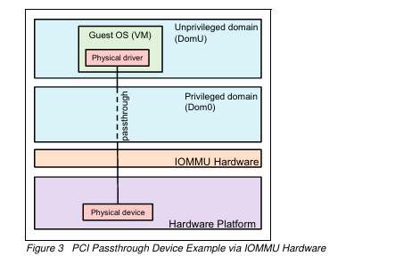

## 3. MMU / IOMMU

차이점

- MMU의 목적
    - CPU가 보이는 가상 주소를 물리적 주소로 변환
    - 일반적인 운영 체제 수준의 가상화 지원
    - 프로세스의 가상 메모리 관리
- IOMMU의 목적
    - 변환된 가상 주소는 장치가 보이는 가상 주소
    - DMA 주소 변환: I/O 장치의 DMA 요청에 대해 가상 주소를 물리적 주소로 변환

IOMMU 하드웨어를 활용한 PCI 패스스루 모델

이거는 WM이 PCI물리적장치(SSD)를 직접 사용할 수있게하는것→ 패스스루 모델IOMMU로 안전하게 구현

<aside>
👉 DMA는 I/O 장치가 CPU 개입 없이 메모리에 직접 접근하는 기술이지만, VM은 가상 환경에서 동작하므로 가상 메모리 주소를 사용하는데 물리적 I/O 장치는 실제 물리적 메모리 주소를 필요로 함 이 두 주소 체계의 불일치로 인해 VM에서 직접 DMA를 사용할 수 없게 됩니다.

IOMMU는 이 문제를 해결하여, VM의 가상 주소를 물리적 주소로 안전하게 변환하고 접근을 제어함으로써, 가상화 환경에서도 DMA의 성능 이점을 안전하게 활용할 수 있게 해줍니다.

PCI 패스스루 기술은 IOMMU를 활용하여 VM이 마치 물리적 PCI 장치에 직접 접근하는 것처럼 동작하게 해주며, 이를 통해 VM은 거의 네이티브 수준의 I/O 성능을 얻을 수 있습니다.

</aside>

DMA는 CPU를 거치지 않고 입출력장치에서 메모리로 데이터를 전송하는 기능

VM은 가상주소를 가지고 있기 때문에 실제 물리주소를 가지는 DMA를 할 수 없다

왜냐하면 VM에 있는 GUEST OS도 가상주소이고 가상화로 만들어졌음

그러나 데이터를 전송을 해야한다

이때 IOMMU는 가상주소를 물리적주소로 바꾸는 역할을 한다

VM이 DMA를 요청하면 가상주소를 IOMMU를 거쳐서 IOMMU가 가상주소를 물리적 주소로 바꾸어주고 DMA 컨트롤러 물리적주소 받아서 물리적 메모리와 물리적 입출력 장치 사이에서 데이터를 전송

<aside>
👉 DMA의 기능: CPU를 거치지 않고 입출력 장치와 메모리 간 직접 데이터 전송

VM의 제한: 가상 주소 사용으로 직접 DMA 불가

IOMMU의 역할: 가상 주소를 물리적 주소로 변환

프로세스: VM(가상 주소) -> IOMMU(주소 변환) -> DMA 컨트롤러(물리적 주소 사용) -> 물리적 메모리와 물리적 입출력 장치 간 데이터 전송

</aside>

<aside>
👉 **PCI 패스스루**

PCI 패스스루는 VM이 물리적 PCI 장치에 직접 접근할 수 있게 해주는 기술

- VM은 가상 주소를 사용하여 I/O 요청을 합니다.
- IOMMU가 이 가상 주소를 물리적 주소로 변환합니다.
- 변환된 물리적 주소를 사용하여 DMA 컨트롤러가 데이터를 전송합니다. (DMA 리매핑이용)
- 물리적 PCI 장치와 물리적 메모리 간에 직접 데이터 전송이 이루어집니다.
</aside>

### IOMMU  하는 일

<aside>
👉 **DMA(직접메모리접근) 리매핑 기능**

- PCI 장치의 주소 변환을 조작
- PCI 장치가 메모리에 직접 접근(DMA)할 때, IOMMU가 장치가 사용하는 가상 주소를 실제 물리적 주소로 변환
- 이를 통해 가상 머신이 PCI 장치를 직접 사용할 수 있으면서도, 메모리 보호와 격리가 유지됩니다.

**인터럽트 리매핑 기능**

- PCI 장치(SSD, USB) 그의 인터럽트를 해당 게스트 OS로 라우팅
    - 물리적 PCI 장치가 인터럽트를 생성합니다.
    - IOMMU의 인터럽트 리매핑 기능이 이 인터럽트를 가로챕니다.
    - 리매핑 테이블을 참조하여 어떤 게스트 OS가 이 PCI 장치를 사용하고 있는지 확인합니다.
    - 인터럽트를 해당 게스트 OS의 가상 인터럽트로 변환합니다.
    - 변환된 인터럽트를 올바른 게스트 OS로 전달
</aside>

**1. 메모리 보호와 격리**

- IOMMU는 I/O 디바이스가 시스템 메모리에 직접 접근하는 것을 제어합니다.
- 각 I/O 디바이스에 가상 메모리 주소를 할당하고, 실제 물리 메모리와 매핑합니다.
- 이를 통해 한 디바이스의 메모리 접근이 다른 디바이스나 운영체제 커널 메모리를 침범하지 않도록 보호합니다.
1. **DMA(Direct Memory Access) 관리**
    - I/O 디바이스는 DMA를 통해 CPU 개입 없이 시스템 메모리에 직접 접근할 수 있습니다.
    - IOMMU는 DMA 리매핑 기능을 통해 I/O 디바이스의 DMA를 관리하고 제어합니다.
    - DMA 리매핑은 I/O 디바이스가 사용하는 가상 주소를 물리 메모리 주소로 변환하는 과정입니다.
    - 이를 통해 승인된 메모리 영역만 접근할 수 있게 하여 불법적인 메모리 접근과 데이터 손상을 방지합니다.
2. **인터럽트 리매핑**
    - I/O 디바이스에서 발생한 인터럽트를 적절한 대상(예: 게스트 OS)에게 전달하는 기능입니다.
    - 가상화 환경에서 IOMMU는 VM(가상머신)에 할당된 I/O 디바이스의 인터럽트를 해당 게스트 OS로 라우팅(전달)합니다.
    - 이를 통해 가상 머신 간의 I/O 디바이스 격리와 보안을 강화할 수 있습니다.
3. **시스템 안정성 향상**
    - IOMMU는 디바이스 드라이버나 펌웨어의 버그로 인한 시스템 불안정성을 완화시킵니다.
    - 메모리 보호와 접근 제어를 통해 잘못된 메모리 참조로 인한 시스템 크래시를 방지합니다.
4. **가상화 지원**
    - 하드웨어 가상화 환경에서 IOMMU는 VM에 할당된 I/O 디바이스를 안전하게 격리시킵니다.
    - DMA 리매핑과 인터럽트 리매핑을 통해 가상 머신 간의 I/O 디바이스 공유와 보안을 가능케 합니다.