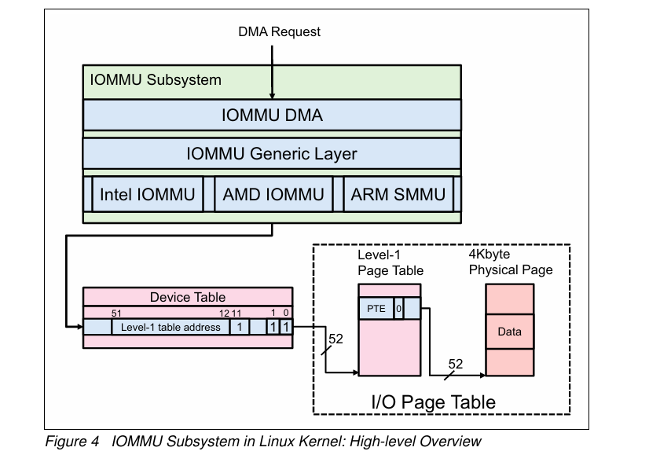

## 4. 리눅스 커널에서의 IOMMU Subsystem

- **I/O 요청이 리눅스 커널에서 어떻게 전파되는지 설명**
- I/O 주소 변환 절차를 이해하기 위해 I/O 페이지 테이블과 데이터 구조를 보여줌
- 운영 체제는 IOMMU 하드웨어 정보를 이해해야 하므로, 시스템 펌웨어는 ACPI 테이블을 통해 IOMMU 설명을 제공

### **리눅스 커널의 IOMMU 서브시스템 – 개요**

1. **IOMMU DMA Layer**: 이 Layer는 I/O 장치로부터 DMA 요청을 받음 IOMMU 일반 Layer로 요청을 전달합니다. DMA-API와 IOMMU-API 사이에 있는 glue layer입니다.
2. **IOMMU 일반 계층(또는 IOMMU-API 계층)**: DMA Layer에서 받은 요청 처리하고, 적절한 하드웨어 특정 IOMMU로 보내기 이 계층은 IOMMU DMA 계층 및 하드웨어 특정 IOMMU 계층과의 상호 작용을 위한 일반 IOMMU API를 제공합니다.
3. **하드웨어 특정 IOMMU 계층**: 기본 IOMMU 하드웨어와 상호 작용하기 위한 하드웨어 특정 드라이버입니다. 또한 IOMMU 하드웨어가 DMA 주소를 올바르게 변환할 수 있도록 요청한 DMA 주소를 기반으로 적절한 I/O 페이지 테이블을 구성합니다. IOMMU 하드웨어는 요청된 DMA 주소를 성공적으로 변환할 수 없는 경우 예외 이벤트를 보고합니다. 일부 필드는 그림 4에서 0 또는 1로 구성
4. Device Table : 각 장치에 대한 IOMMU 설정 제어 DMA 허용 0 1, 인터럽트 리매핑

<aside>
👉 프로세스

- I/O 장치가 DMA 요청을 보냅니다.
- IOMMU DMA Layer가 이 요청을 받아 처리합니다.
- Generic Layer를 통해 요청이 전달됩니다.
- 하드웨어 특정 IOMMU 층에서 Device Table을 참조하여 해당 장치의 설정(Level-1 table addres)을 확인합니다.
- I/O Page Table을 사용하여 가상 주소를 물리적 주소로 변환합니다.
- 변환된 주소로 DMA 작업이 수행합니다.
</aside>