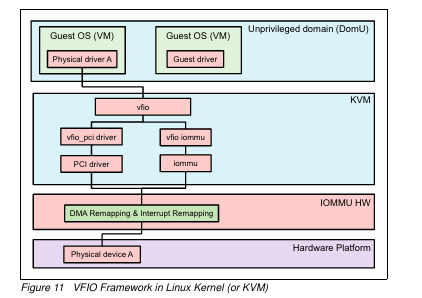

## 9. VFIO

- 직접 디바이스 액세스를 위한 사용자 공간 애플리케이션을 제공하는 것을 목표
- 리눅스 커널의 프레임워크로, 사용자 공간 드라이버에게 직접적이고 안전한 장치 접근을 제공합니다.
- VFIO 프레임워크가 게스트 OS, PCI 드라이버 및 IOMMU 드라이버와 어떻게 협력
- 가상 머신이나 사용자 프로그램이 컴퓨터의 하드웨어(예: 그래픽 카드, 네트워크 카드)에 직접 안전하게 접근할 수 있게 해줍니다.
- IOMMU를 사용하여 안전하게 접근하게

- 향상된 I/O 성능
- 강화된 보안 및 격리
- 유연한 장치 할당

- VFIO는 사용자 공간 드라이버가 안전하게 PCI 장치에 접근할 수 있는 프레임워크를 제공합니다.
- 가상화 환경에서 VM이 직접 하드웨어를 제어할 수 있게 합니다.

일반적인 동작 흐름:
a. 게스트 OS에서 Physical driver A 또는 Guest driver가 I/O 요청을 시작합니다.
b. 요청은 KVM 층의 vfio 인터페이스로 전달됩니다.
c. vfio는 요청 유형에 따라 적절한 드라이버(vfio pci driver 또는 PCI driver)로 라우팅합니다.
d. 드라이버는 IOMMU를 통해 메모리 매핑을 설정합니다.
e. 요청은 IOMMU/HW 층을 통과하여 실제 하드웨어로 전달됩니다.
f. 하드웨어의 응답은 역순으로 게스트 OS로 돌아갑니다.

장치 할당: 특정 PCI 장치를 VFIO 그룹에 할당합니다.
b. IOMMU 활용: DMA 리매핑을 통해 장치 메모리 접근을 제어합니다.
c. 인터럽트 라우팅: 장치 인터럽트를 적절한 가상 머신으로 전달합니다.

VFIO의 주요 이점:
가상 머신에 대한 직접 장치 액세스: VFIO를 사용하면 가상 머신이 물리적 하드웨어 장치에 직접 액세스할 수 있습니다. 이러한 "장치 할당" 접근 방식을 통해 대기 시간이 단축되고 대역폭이 높아지며 기본 장치 드라이버를 사용할 수 있으므로 베어 메탈에 가까운 성능을 달성할 수 있습니다.

고성능 컴퓨팅(HPC): 맞춤형 네트워크 프로토콜이나 특수 컴퓨팅 가속기와 같이 오버헤드가 낮은 통신이 필요한 HPC의 애플리케이션은 최소한의 커널 개입으로 장치에 대한 직접적인 사용자 공간 액세스를 허용함으로써 VFIO의 이점을 누릴 수 있습니다.

보안 및 격리: VFIO는 IOMMU를 활용하여 장치가 서로 격리되고 임의 시스템 메모리로부터 격리되도록 보장하여 DMA(직접 메모리 액세스) 공격과 관련된 위험을 완화합니다. 이 격리는 함께 격리할 수 있는 장치 집합을 나타내는 IOMMU 그룹을 통해 관리됩니다.

VFIO 무엇?

VFIO(Virtual Function I/O)는 사용자 공간 애플리케이션이 하드웨어 장치와 직접 상호 작용할 수 있도록 하는 동시에 이 상호 작용이 안전하고 시스템의 나머지 부분과 격리되도록 하는 리눅스 커널 프레임워크입니다. VFIO는 IOMMU(Induction Memory Management Unit) 및 장치에 구애받지 않도록 설계되었으며, 이는 다양한 하드웨어 아키텍처에서 다양한 유형의 장치 및 IOMMU와 함께 작동할 수 있음을 의미합니다.

왜?

보안: IOMMU를 활용하여 VFIO는 장치에 직접 액세스하더라도 임의의 메모리 위치를 읽거나 쓸 수 없도록 하여 시스템 무결성을 보호합니다.

고성능 I/O: 가상 머신(VM)은 특히 네트워킹 및 스토리지와 같은 I/O 집약적인 작업의 경우 기본 성능에 가까운 하드웨어 장치에 직접 액세스해야 하는 경우가 많습니다. VFIO를 사용하면 장치를 VM에 직접 할당할 수 있고, VM은 물리적으로 연결된 것처럼 사용할 수 있습니다.

사용자 공간 장치 드라이버: 전통적으로 장치 드라이버는 시스템 리소스에 대한 완전한 액세스 권한을 가진 커널 공간에서 실행됩니다. VFIO는 권한이 없는 사용자가 사용자 공간에서 장치 드라이버를 실행할 수 있도록 하여 시스템 충돌 및 보안 위반의 위험을 줄입니다.