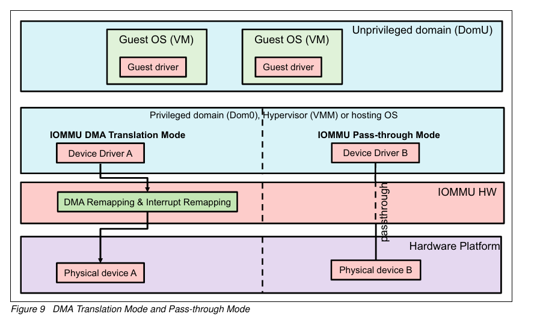

## 8. 리눅스 커널 IOMMU : DMA 변환 모드 / 패스스루 모드

**IOMMU DMA Translation Mode(왼쪽)**

- 호스팅 OS(하이퍼바이저)가 DMA 변환을 위해 IOMMU 지원 연산을 적용한다는 것을 의미
- 호스팅 OS의 IOMMU 드라이버는 모든 DMA 요청을 검사하고 해당 IOMMU 하드웨어가 올바르게 변환할 수 있도록 구성
- 호스팅 OS(하이퍼바이저)가 IOMMU를 통해 DMA 변환을 수행
- IOMMU 드라이버가 모든 DMA 요청을 검사하고 IOMMU 하드웨어를 구성
- DMA 주소와 시스템 물리 주소 간의 변환이 이루어짐
- DMA 변환 모드: 보안성 높음, 성능 오버헤드 있음
- DMA 변환 모드: 일반적인 시스템 보안이 중요한 경우    

#### **IOMMU Pass-through Mode(오른쪽,2번사진)**

패스스루 : 가상화 환경에서 게스트 OS가 물리적 장치에 직접 접근할 수 있게 해줌.

vm 장치 → iommu 생략하고 주소변환하지 않고 → 장치

- 하이퍼바이저의 관점에서 DMA 변환을 우회하는데, 이는 DMA 주소가 시스템 물리적 주소와 동일하다는 것을 의미
- 주소 변환 우회: IOMMU는 해당 장치에 대한 DMA 주소 변환을 수행하지 않음.
- DMA 주소가 시스템 물리 주소와 동일가상화 환경에서 널리 사용됨
- 특히 PCI 패스스루 모델과 함께 사용
- 패스스루 모드: 성능 향상, 직접 하드웨어 접근 가능, 보안 위험 존재
- 패스스루 모드: 가상화 환경에서 성능이 중요한 경우, 특히 I/O 집약적 워크로드   

### PCI 패스스루와 IOMMU 패스스루의 차이점은 무엇입니까?

- PCI 패스스루 모델
    - vm에서 pci에서 dma로 바로 물리적 장치로
    - 목적: 게스트 OS가 물리적 PCI 장치를 직접 제어할 수 있게 함
    - 작동: 하이퍼바이저의 개입을 우회하 게스트 OS가 장치를 직접 관리
    - 효과: I/O 성능 향상, 네이티브 드라이버 사용 가능
    - 장치 제어 레벨에서 작동
- IOMMU 패스스루
    - Pass-through를 수행하는 디바이스 드라이버의 DMA 주소는 시스템 물리주소(SPA)를 통해서 접근
    - 목적: DMA(직접 메모리 접근) 요청에 대한 주소 변환을 우회
    - 작동: 하이퍼바이저가 DMA 요청을 처리하지 않음
    - 효과: DMA 작업의 오버헤드 감소, 직접적인 메모리 접근 가능
    - 메모리 접근 레벨에서 작동

함께 사용 시: 게스트 OS가 물리적 장치를 완전히 제어하고 효율적으로 사용 가능
  

### BIOS 설정에서 IOMMU 패스스루 모드와 IOMMU 옵션 비활성화의 차이점은 무엇입니까?

BIOS에서 IOMMU 비활성화:

- **IOMMU 하드웨어가 OS에 노출되지 않음**
- ACPI 테이블에 IOMMU 관련 데이터 구조가 포함되지 않음
- OS가 IOMMU 하드웨어와 상호작용할 수 없음
- **DMA 주소가 시스템 물리 주소와 동일 (변환 불필요)**
- **게스트 OS가 물리적 장치에 직접 접근할 수 없음**

IOMMU 패스스루 모드:

- **IOMMU 하드웨어가 OS에 노출됨**
- **DMA 주소가 시스템 물리 주소와 동일 (변환 우회)**
- **게스트 OS가 IOMMU의 도움으로 물리적 장치에 직접 접근 가능**
- PCI 패스스루 모델과 함께 사용 시 SW 변경 없이 직접 접근 가능

- IOMMU 패스스루 모드와 IOMMU 비활성화 시 동일

주요 차이점:

- 장치 접근: IOMMU 패스스루 모드에서는 게스트 OS의 직접 장치 접근이 가능하지만, IOMMU 비활성화 시에는 불가능
- 유연성: IOMMU 패스스루 모드는 필요에 따라 DMA 변환을 활성화할 수 있지만, IOMMU 비활성화는 이 옵션을 완전히 제거
- 가상화 지원: IOMMU 패스스루 모드는 가상화 환경에서 유용한 기능을 제공하지만, IOMMU 비활성화는 이러한 기능을 사용할 수 없게 함
- IOMMU 패스스루 모드와 PCI 패스스루 모델 덕분에 게스트 OS는 SW 변경 없이 물리적 디바이스에 직접 액세스
- 호스팅 OS는 게스트 OS와 물리적 디바이스 사이에 상호 작용하는 특정 구성 요소가 필요