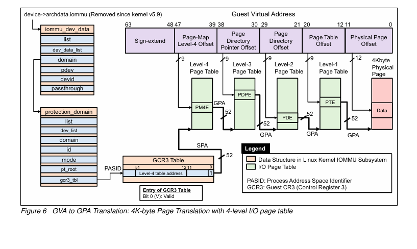
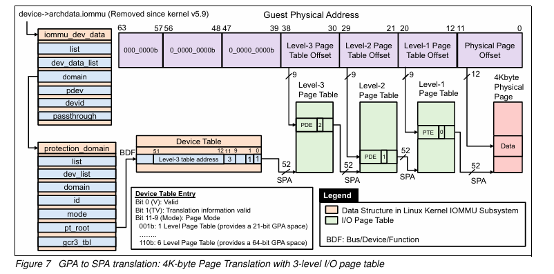

## 6. 2단계 주소 변환

1. 게스트 가상 주소(GVA)를 게스트 물리적 주소로 매핑하는 게스트 변환(GPA)
2. GPA를 시스템 물리 주소에 매핑하는 호스트 변환(또는 중첩 변환) (SPA)

### GVA → GPA

1 . 4-level I/O 페이지 테이블을 사용한 4K 바이트 페이지 변환

- GCR3 테이블과 level-4 테이블 주소는 SPA
- PM4E, PDPE(Page Directory Pointer Entry), PDE(Page Directory Entry), PTE(Page Table Entry)는 GPA

→ 이것은 물리적 메모리로부터 페이지 테이블 데이터를 얻기 위해서는 해당 GPA가 SPA로 변환되어야 함을 의미

- 시작 (GCR3, Level-4 테이블 주소): SPA
- 중간 과정 (PM4E → PDPE → PDE → PTE → 물리 페이지): 모두 GPA
- 최종 단계: GPA를 SPA로 변환

- 중첩된 주소 변환(또는 호스트)

  translation)이 요구사항을 달성합니다. Linux IOMMU 서브시스템은 IOMMU 하드웨어가 DMA 번역을 적절히 처리할 수 있도록 I/O 페이지 테이블과 GCR3 테이블을 구성

주소 유형 구분의 중요성:

- GCR3와 Level-4 테이블 주소가 SPA인 이유:
  IOMMU나 하이퍼바이저가 실제 물리 메모리에 직접 접근해야 하기 때문
- 나머지 테이블이 GPA인 이유:
  게스트 OS의 관점에서 "물리적" 주소이지만, 실제 물리 메모리와는 다른 주소 공간

최종정리

- 개요:
    - 이 그림은 4KB 페이지 크기를 사용하는 4-레벨 I/O 페이지 테이블을 통한 GVA에서 GPA로의 변환 과정을 보여줍니다.
    - 전체 주소 변환은 두 단계로 이루어집니다: GVA → GPA (게스트 OS), GPA → SPA (호스트 OS/IOMMU)
- GVA 구조 (48비트):
    - Sign-extend (비트 63-48): 3비트
    - Page-Map Level-4 Offset (비트 47-39): 9비트
    - Page Directory Pointer Offset (비트 38-30): 9비트
    - Page Directory Offset (비트 29-21): 9비트
    - Page Table Offset (비트 20-12): 9비트
    - Physical Page Offset (비트 11-0): 12비트
- 변환 과정:
  a) PASID를 사용하여 GCR3 테이블에서 Level-4 페이지 테이블의 SPA를 찾습니다.
  b) Level-4 페이지 테이블(PM4E)에서 Page Directory Pointer의 GPA를 찾습니다.
  c) Level-3 페이지 테이블(PDPE)에서 Page Directory의 GPA를 찾습니다.
  d) Level-2 페이지 테이블(PDE)에서 Page Table의 GPA를 찾습니다.
  e) Level-1 페이지 테이블(PTE)에서 최종 물리 페이지의 GPA를 찾습니다.
- 주요 특징:
    - GCR3 테이블과 Level-4 테이블 주소는 SPA입니다.
    - PM4E, PDPE, PDE, PTE 및 최종 물리 페이지 주소는 모두 GPA로 표현됩니다.
    - 각 레벨의 페이지 테이블은 512개의 엔트리를 가집니다(9비트로 표현 가능).
- Linux IOMMU 서브시스템:
    - iommu_dev_data.domain → protection_domain.gcr3_tbl를 통해 I/O 페이지 테이블 주소에 접근합니다.
    - I/O 페이지 테이블과 GCR3 테이블을 구성하여 IOMMU 하드웨어의 DMA 변환을 지원합니다.
- 중첩된 주소 변환:
    - 각 페이지 테이블 엔트리(PM4E, PDPE, PDE, PTE)는 GPA를 가리킵니다.
    - 실제 물리 메모리 접근을 위해 이 GPA를 SPA로 추가 변환해야 합니다.
    - 이 추가 변환은 그림에 나타나지 않았으며, IOMMU나 하이퍼바이저에 의해 수행됩니다.
- 페이지 폴트 처리:
    - GVA에서 GPA로 접근 시 매핑된 데이터가 없는 경우, 폴트가 발생합니다.
    - 이 경우 GPA → SPA 변환을 수행하여 데이터를 GPA로 매핑합니다.

<aside>
👉 장치에서 시작하여 PASID를 통해 적절한 GCR3 테이블 엔트리를 찾고, 이를 통해 게스트의 페이지 테이블에 접근하는 과정

- GVA로 PM4E 접근:
    - GVA의 최상위 비트들을 사용하여 PM4E 내의 특정 엔트리를 찾습니다. SPA를 사용해서 Level-4 Page Table에 접근
    - PM4E의 시작 주소는 CR3 레지스터나 GCR3 테이블에서 가져옵니다.
- PM4E 엔트리 내용:
    - 맞습니다. PM4E 엔트리 안에 PDPE(Level-3 테이블)의 GPA가 있습니다.
- PDPE 접근:
    - IOMMU가 PM4E에서 얻은 PDPE의 GPA를 SPA로 변환합니다.
    - 이 SPA를 사용하여 실제 물리 메모리의 PDPE에 접근합니다.
</aside>

- protection_domain:
    - IOMMU 보호 도메인과 관련된 정보를 포함합니다.
    - 여기에는 장치 목록, 도메인 ID, 모드 등의 정보가 포함됩니다.
- PASID (Process Address Space ID):
    - 프로세스 주소 공간 식별자입니다.
    - 여러 프로세스나 가상 머신이 동일한 I/O 장치를 공유할 때 사용됩니다.

### GPA → SPA

Figure 7은 GPA(Guest Physical Address)에서 SPA(System Physical Address)로의 변환 과정을 보여주는 3-레벨 I/O 페이지 테이블 구조

1. 목적:
   Guest Physical Address (GPA)를 System Physical Address (SPA)로 변환하는 과정을 보여줍니다.
2. 입력:
   Guest Physical Address (GPA) - 그림 상단에 표시됨
    - 비트 63-57: 사용되지 않음 (000_0000b)
    - 비트 56-48: Level-3 Page Table Offset
    - 비트 47-39: Level-2 Page Table Offset
    - 비트 38-30: Level-1 Page Table Offset
    - 비트 29-12: Physical Page Offset
    - 비트 11-0: 페이지 내 Offset
3. 페이지 테이블 구조:
    - Device Table
    - Level-3 Page Table
    - Level-2 Page Table
    - Level-1 Page Table
      모든 테이블의 주소와 엔트리는 SPA로 표현됩니다.
4. 변환 과정:
   a) BDF(Bus/Device/Function)를 사용해 Device Table 접근 (SPA)
   b) Device Table에서 Level-3 Page Table의 기본 주소(SPA) 획득
   c) GPA의 비트 56-48을 사용해 Level-3 Page Table 엔트리 선택
   d) Level-3 엔트리에서 Level-2 Page Table의 기본 주소(SPA) 획득
   e) GPA의 비트 47-39를 사용해 Level-2 Page Table 엔트리 선택
   f) Level-2 엔트리에서 Level-1 Page Table의 기본 주소(SPA) 획득
   g) GPA의 비트 38-30을 사용해 Level-1 Page Table 엔트리 선택
   h) Level-1 엔트리에서 최종 물리 페이지의 기본 주소(SPA) 획득
   i) GPA의 비트 29-0을 SPA에 더해 최종 물리 주소 계산
5. 특징:
    - 모든 페이지 테이블과 엔트리가 SPA로 표현되어 있어, 추가적인 주소 변환이 필요 없습니다.
    - IOMMU는 이 구조를 사용하여 GPA에 해당하는 SPA를 직접 찾아낼 수 있습니다.
6. 용도:
    - 가상화 환경에서 I/O 디바이스의 DMA 요청을 처리할 때 사용됩니다.
    - 게스트 OS와 호스트 시스템 간의 메모리 격리를 제공합니다.

이 구조를 통해 IOMMU는 게스트 OS가 사용하는 물리 주소(GPA)를 실제 시스템의 물리 주소(SPA)로 효율적으로 변환할 수 있습니다.

<aside>
👉 IOMMU는 GPA를 SPA로 변환합니다. 각 단계에서 페이지 테이블 엔트리가 가리키는 주소는 SPA이며, 이를 사용하여 다음 레벨의 페이지 테이블 또는 최종 물리 페이지에 접근합니다. GPA는 각 레벨에서 올바른 엔트리를 찾는 인덱스로 사용

</aside>

**차이**

Figure 6 (GVA to GPA 변환):

1. 목적: 게스트 가상 주소(GVA)를 게스트 물리 주소(GPA)로 변환
2. 구조:
    - GCR3 Table: SPA로 표현
    - Level-4 Page Table (PM4E)부터: GPA로 표현
3. 변환 과정:
   GVA → GCR3 Table(SPA) → PM4E(GPA) → PDPE(GPA) → PDE(GPA) → PTE(GPA) → 최종 GPA
4. 특징:
    - 게스트 OS의 관점에서 수행되는 주소 변환
    - 실제 물리 메모리 접근을 위해서는 추가적인 GPA → SPA 변환이 필요

Figure 7 (GPA to SPA 변환):

1. 목적: 게스트 물리 주소(GPA)를 시스템 물리 주소(SPA)로 변환
2. 구조:
    - Device Table부터 모든 페이지 테이블: SPA로 표현
3. 변환 과정:
   GPA → Device Table(SPA) → Level-3 PT(SPA) → Level-2 PT(SPA) → Level-1 PT(SPA) → 최종 SPA
4. 특징:
    - IOMMU의 관점에서 수행되는 주소 변환
    - 게스트 OS의 I/O 요청을 실제 물리 메모리에 직접 매핑

- Figure 6: 게스트 OS의 일반적인 메모리 접근
- Figure 7: 게스트 OS의 I/O 요청 처리

추가 변환 필요성:

- Figure 6: GPA → SPA 추가 변환 필요
- Figure 7: 추가 변환 불필요